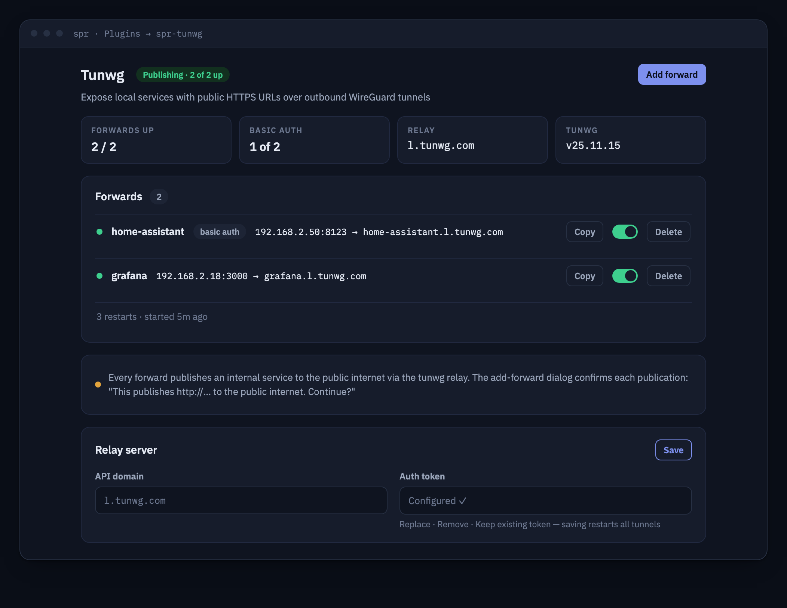

# spr-tunwg



Expose local services on your SPR network at public HTTPS URLs, using
[tunwg](https://github.com/ntnj/tunwg) — end-to-end encrypted tunnels over
outbound userspace WireGuard, with automatic SSL certificates.

> ## ⚠️ This plugin makes internal services public
>
> **Every forward publishes an internal service to the public internet.**
> Traffic flows through the tunwg relay (`l.tunwg.com` by default, or your
> self-hosted server), and anyone who learns the URL can reach the target
> device. Generated hostnames are **not secret**: certificates are logged in
> public certificate transparency logs, and crawlers monitor those logs, so
> expect automated probes shortly after a tunnel comes up. This plugin is
> outward-facing by design — use it deliberately, and prefer enabling the
> built-in HTTP basic auth on every forward that isn't meant for the whole
> world.

## About

The plugin runs one `tunwg` child process per configured *forward*. Each
forward maps a LAN service (e.g. `http://192.168.2.50:8123`) to a stable
public HTTPS URL (e.g. `https://xxxxxxxxxx.l.tunwg.com`). tunwg runs
WireGuard entirely in userspace (gVisor netstack), so the container needs
**no capabilities, no `/dev/net/tun`, and no listening host ports** — all
tunnel traffic is outbound (WireGuard UDP, or HTTPS with the relay option).

The Go backend supervises the tunwg processes, parses each forward's
assigned public URL from its output, and serves a REST API plus the embedded
React UI over the plugin unix socket. SPR shows the UI under **Plugins →
spr-tunwg** (iframe).

## Features

- Forward any LAN http(s) service to a public HTTPS URL — no port
  forwarding, no dynamic DNS, no inbound firewall holes
- Stable subdomains: the URL is derived from a persistent per-forward
  WireGuard key (`TUNWG_KEY`), so it survives restarts
- Optional HTTP basic auth per forward (htpasswd/bcrypt, tunwg `--limit`)
- Optional WireGuard-over-HTTPS relay per forward (`TUNWG_RELAY`) for
  networks that block UDP
- Optional self-hosted tunwg server (`TUNWG_API` + `TUNWG_AUTH`)
- Live status: per-forward running state, public URL with copy button,
  restart counter, diagnosed startup failures, remediation hints and a
  bounded log tail
- Automatic supervision: crashed tunnels restart with backoff
- Contributes to SPR's topology view (`HasTopology`): each forward's LAN
  target and the tunwg relay appear as nodes in the router topology graph

## Install (UI)

1. In the SPR UI go to **Plugins**, click **+ New Plugin**
2. Enter this repository's GitHub URL (e.g.
   `https://github.com/spr-networks/spr-tunwg`)
3. SPR builds and starts the plugin; open **spr-tunwg** in the Plugins menu

## Install (CLI)

```sh
./install.sh
```

Prompts for your SPR super directory (default `/home/spr/super/`) and an SPR
API token (generate one on the Auth Keys page), writes the plugin configs,
builds and starts the container, and registers the `spr-tunwg` interface
with the SPR firewall (`lan` + `wan` policies).

## Using it

Click **Add Forward** and give the forward a name and a LAN target URL such
as `http://192.168.2.50:8123`. Once the tunnel connects, the public URL
appears in the forwards table — copy it with the copy button. Toggle a
forward off to stop publishing it; delete it to remove it entirely.

To require credentials, enter a basic auth username and password while adding
the forward. The frontend hashes the password with bcrypt for tunwg. It also
saves the plaintext password in the plugin's mode-0600 configuration so an SPR
administrator can use **Show credentials** on the forward later. Forwards made
by older plugin versions still reveal their username, but their password cannot
be recovered from the previously stored bcrypt hash.

## API

All endpoints are served on the plugin unix socket
(`/state/plugins/spr-tunwg/socket`) and proxied by SPR under
`/plugins/spr-tunwg/`.

| Method | Path | Description |
| --- | --- | --- |
| GET | `/status` | Plugin status: tunwg version, relay domain, forward counts |
| GET | `/topology` | Topology graph `{Nodes, Edges}` merged into SPR's topology view: root anchor (WireGuard transport), one `service` node per forward's LAN target (online after a public URL is announced), one `relay` node for the relay domain (online = any tunnel up); edges service→root (`lan`) and root→relay (`tunnel`) |
| GET | `/forwards` | List forwards with running state, assigned public URL and diagnosed last failure (credentials redacted) |
| POST | `/forwards` | Add a forward `{Name, LocalURL, Key?, Auth?, AuthPassword?, Relay?, Enabled}`; enabled forwards return `StartupError` when the initial connection fails |
| GET | `/forwards/{name}/credentials` | Explicitly reveal the saved basic-auth username/password (`Cache-Control: no-store`); legacy forwards have no recoverable password |
| GET | `/forwards/{name}/log` | Read the bounded, sanitized output buffer for the current or most recent tunwg run |
| DELETE | `/forwards/{name}` | Stop and remove a forward |
| POST | `/forwards/{name}/toggle` | Enable/disable a forward |
| GET | `/config` | Relay settings (`APIDomain`, `AuthTokenConfigured`) |
| PUT | `/config` | Update relay settings `{APIDomain, AuthToken?, ClearAuthToken?}` |
| GET | `/` | Embedded UI (`/ui/index.html`) |

## Configuration reference

`/configs/plugins/spr-tunwg/config.json` (written by the backend, mode 0600):

| Field | Description |
| --- | --- |
| `APIDomain` | Optional tunwg server domain (`TUNWG_API`); empty = public `l.tunwg.com` |
| `AuthToken` | Optional `TUNWG_AUTH` token for self-hosted servers (redacted in API reads) |
| `Forwards[].Name` | Forward name (1–32 chars, `[a-z0-9-]`) |
| `Forwards[].LocalURL` | Target, `http(s)://<private-LAN-IP>[:port]`. Loopback, link-local and public addresses are rejected server-side; hostnames are rejected (use the device IP) |
| `Forwards[].Key` | Optional `TUNWG_KEY` name for the WireGuard key (defaults to the forward name); determines the stable public subdomain. Redacted in API reads |
| `Forwards[].Auth` | Optional `user:hash` (htpasswd format) for tunwg `--limit` basic auth. Redacted in API reads |
| `Forwards[].AuthPassword` | Optional recoverable basic-auth password used by **Show credentials**. Stored in the mode-0600 config and returned only by the explicit credentials endpoint |
| `Forwards[].Relay` | `true` = tunnel WireGuard over HTTPS (`TUNWG_RELAY`), for UDP-hostile networks |
| `Forwards[].Enabled` | Whether the tunnel runs |

WireGuard private keys are kept in
`/state/plugins/spr-tunwg/tunwg/keys/<key-name>` (created by tunwg with mode
0400 in a 0700 directory). Keys persist across restarts and deletes so a
re-created forward with the same key name gets the same public URL.

## Security model

- **Exposure**: every enabled forward is intentionally public. The tunwg
  relay terminates TCP for your subdomain and forwards it into the tunnel;
  TLS is end-to-end (certificates are issued *inside* the plugin), but the
  URL itself is discoverable via certificate transparency. Use per-forward
  basic auth for anything sensitive.
- **Container**: no capabilities (`cap_add` empty), no `privileged`, no
  `/dev/net/tun` (userspace WireGuard), `no-new-privileges:true`, **no
  published host ports** — the only listener is the plugin unix socket.
- **Network**: dedicated docker bridge `spr-tunwg` with SPR policies
  `lan` (to reach the LAN services being forwarded) and `wan` (outbound
  tunnel traffic to the relay). No `api` policy: the backend never calls the
  SPR API.
- **Secrets**: `config.json` is written 0600. `TUNWG_KEY` names, basic-auth
  hashes, saved basic-auth passwords and the relay auth token are omitted from
  normal list/config responses. An authenticated SPR administrator can reveal
  a forward's saved username/password through the explicit no-store
  credentials endpoint. WireGuard private keys are 0400.
- **Input validation**: all forward fields are validated server-side
  (allow-list character sets; targets must be private-range IP literals with
  sane ports). tunwg is always spawned with an argv array and a minimal
  environment — no shell interpolation.

## Upstream

- Project: [github.com/ntnj/tunwg](https://github.com/ntnj/tunwg) (MIT
  license), built from source at release `v25.11.15+bbd247b`, pinned by full
  commit hash in `reproducible.env`
- The public relay `l.tunwg.com` is a community service run by the tunwg
  author on limited-bandwidth infrastructure; self-host a tunwg server for
  critical use

## Reproducible builds

All build inputs (base image digests, Ubuntu snapshot, Go toolchain
sha256s, tunwg commit) are pinned in `reproducible.env`.
`./build_docker_compose.sh` builds the image bit-for-bit reproducibly
(buildkit `rewrite-timestamp`, `SOURCE_DATE_EPOCH=0`); `./update-pins.sh`
re-resolves every pin (including the latest tunwg release tag) and syncs the
Dockerfile ARG defaults. CI (`.github/workflows/docker-image.yml`) builds
multi-arch images, signs them with cosign and attaches SLSA provenance.

## License

MIT — see [LICENSE](LICENSE). tunwg is MIT-licensed by its upstream author.
